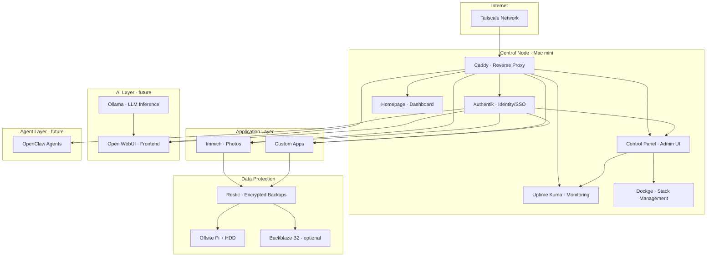

# Homelab Platform Design

> Version: **1.2-draft** | Date: 2026-02-17 | Owner: Brian

## Vision

A self-hosted homelab platform that replaces cloud-based services with containerised applications running on hardware at home. The platform serves a family with robust identity management, secure remote access, and tested disaster recovery — while remaining simple enough for one person to operate.

The initial focus is a proof of concept that validates core assumptions. If viable, the project will be opened to contributors and simplified for broader adoption.

## What is OpenClaw?

OpenClaw is the planned AI agent layer for this platform. Each family member gets a personal agent scoped to their permissions and data. Agents interact with homelab applications on behalf of users while enforcing access controls. An admin-level agent handles platform operations (deploys, backups, updates). OpenClaw is currently **conceptual** — the management contract and multi-agent access model are defined in [docs/agent-model.md](docs/agent-model.md) but no implementation exists yet.

## Project Metadata

| Field | Value |
|-------|-------|
| Owner | Brian |
| Primary host | Mac mini (home services node) |
| DR host | Relative's house (Raspberry Pi + external HDD) |
| Primary goals | Standardised installs, clean management, family access control, secure remote access, tested disaster recovery |

---

## 1. Principles

1. **One install method:** Docker Compose for all self-hosted services.
2. **One app = one folder** — `compose.yml`, `.env`, `data/`, `README.md`, `backups/`.
3. **No direct internet exposure.** Tailscale for all remote access by default.
4. **Identity-first access.** Centralised users and groups via Authentik.
5. **Backups are mandatory; restore tests are mandatory.**
6. **Changes are reversible** — pinned image tags, documented rollback paths.
7. **Resource-aware defaults** — the Mac mini is capable but disk-limited and shared with other uses.

---

## 2. Architecture Overview



### Component inventory

| Layer | Component | Purpose | Status |
|-------|-----------|---------|--------|
| **Core platform** | Docker Engine + Compose | Container runtime | Ready |
| | Control Panel | Unified admin management UI | Design |
| | Dockge | Stack management UI | Phase 1 |
| | Homepage | Dashboard | Phase 1 |
| | Caddy | Reverse proxy / local DNS | Phase 1 |
| | Tailscale | Secure remote access | Phase 1 |
| | Uptime Kuma | Health monitoring | Phase 1 |
| **Identity** | Authentik | SSO, users, groups, RBAC | Phase 2 |
| **Data protection** | Restic | Encrypted backups | Phase 5 |
| | Raspberry Pi + HDD | Offsite backup target | Phase 5 |
| | Backblaze B2 | Optional cloud backup | Phase 5 |
| **Applications** | Immich | Photo management | Phase 3 |
| **AI** | Ollama | LLM inference | Phase 6 |
| | Open WebUI | AI chat frontend | Phase 6 |
| **Agents** | OpenClaw | Multi-user AI agents | Future |

---

## 3. Filesystem Layout

```text
~/homelab/
├── apps/
│   └── <app-name>/
│       ├── compose.yml
│       ├── .env
│       ├── .env.example
│       ├── data/
│       ├── backups/
│       ├── app-contract.yaml
│       └── README.md
├── platform/
│   ├── control-panel/
│   ├── dockge/
│   ├── homepage/
│   ├── caddy/
│   ├── uptime-kuma/
│   ├── authentik/
│   └── tailscale/
├── ai/
│   ├── ollama/
│   ├── open-webui/
│   └── models/                  # external storage mount target
├── backups/
│   ├── local/
│   ├── manifests/
│   └── restore-tests/
├── scripts/
│   ├── app-up
│   ├── app-down
│   ├── app-update
│   ├── app-backup
│   ├── app-restore
│   └── dr-verify
└── docs/
    ├── control-panel.md          # homelab control panel design outline
    ├── security.md               # security model, threat model, controls
    ├── app-spec.md              # developer application specification
    ├── ops-standard.md          # backup, DR, security, restart standards
    ├── rollout-plan.md          # phased implementation plan
    ├── agent-model.md           # OpenClaw multi-agent access model
    ├── onboarding.md             # admin bootstrap and user management
    ├── teardown.md               # controlled teardown and reinstall
    ├── app-ideas.md              # candidate application tracker
    ├── dependencies.md           # licensing, dependencies, portability
    ├── inventory.md
    ├── access-matrix.md
    ├── nodes.md
    ├── runbook.md
    ├── dr-runbook.md
    ├── notes/
    │   └── mac-mini.md
    └── adrs/
        ├── template.md
        ├── 001-docker-compose.md
        ├── 002-authentik-identity.md
        ├── 003-caddy-reverse-proxy.md
        ├── 004-tailscale-remote-access.md
        └── 005-restic-backups.md
```

**Rules:**
- Folder names are lowercase kebab-case.
- Persistent app data lives under that app's folder (or an approved external mount path).
- All exposed ports, domains, owners, and backup targets are recorded in `docs/inventory.md`.

---

## 4. Networking & Remote Access

### Local access
Stable local hostnames via Caddy:
- `immich.home` — photo management
- `login.home` — Authentik
- `status.home` — Uptime Kuma
- `ai.home` — Open WebUI

### Remote access
- Tailscale-only by default (MagicDNS preferred).
- No router port forwarding unless explicitly approved and documented.

### Port policy
- Prefer internal Docker networks.
- Publish host ports only when required.
- Admin UIs restricted to LAN/Tailscale.

---

## 5. Storage Strategy

### Phase A — Internal disk
- Platform services run on internal storage.
- Media-heavy apps constrained initially.
- **Warning** at 75% disk used, **action required** at 85%.

### Phase B — External expansion
Add external SSD for large-state workloads. Migration priority:
1. Immich media/library
2. Backup repositories and snapshots
3. AI model files

Stable mount path convention:
- `/Volumes/HomelabData/immich-library`
- `/Volumes/HomelabData/backups`
- `/Volumes/HomelabData/models`

Configs and lightweight databases remain on internal disk.

---

## 6. Identity & Access Management

### Identity provider
Authentik hosted on the Mac mini (critical service).

### User policy
- One account per person — no shared family passwords.
- Group-based access control (RBAC), not per-user app tweaks.

### Baseline groups

| Group | Purpose |
|-------|---------|
| `homelab-admin` | Full platform administration |
| `parents` | Parent-level access across apps |
| `kids` | Child-level access with safety restrictions |
| `immich-admin` | Immich administration |
| `immich-user` | Immich standard user |
| `ai-admin` | AI platform administration |
| `ai-user` | AI standard user |
| `ai-kids` | AI access with child safety policy |

New apps add `<app>-admin` and `<app>-user` groups at minimum.

### App integration pattern
1. Register app in Authentik.
2. Configure OIDC (preferred), SAML, or LDAP as supported.
3. Map Authentik groups to app roles.
4. Maintain a local emergency admin account ("break-glass"), documented securely.

### UX customisation
Authentik branding (logo, colours, domain, text) is encouraged. Avoid deep custom UI forks that increase upgrade fragility.

---

## 7. AI Integration (future)

- **Runtime:** Ollama + Open WebUI via Compose.
- **Storage:** Model files on external SSD/NVMe.
- **Access:** Authentik groups gate usage (`ai-admin`, `ai-user`, `ai-kids`). Tools and internet connectors restricted by group.
- **Operations:** Monitor CPU/RAM/disk and request latency. Set usage quotas and concurrency limits. Cloud fallback optional, not default.

---

## 8. Multi-Node Scaling (future)

The architecture supports scaling beyond one Mac mini by adding specialised nodes.

### Node roles

| Role | Hardware | Services |
|------|----------|----------|
| **Control** | Mac mini (primary) | Authentik, Caddy, Homepage, Uptime Kuma, OpenClaw |
| **App** | Additional machines | Immich, custom apps |
| **AI** | GPU machine | Ollama/vLLM, model storage |
| **DR** | Offsite Pi + HDD | Encrypted backup target, restore staging |

### Key principles
- Stable service URLs regardless of host node (`immich.home` works whether Immich runs on Mac mini or an app node).
- Single Authentik authority for all nodes.
- App data stays local to hosting node; replicate via backup/restore, not ad-hoc shared mounts.
- Node failure is isolated — AI node issues don't impact the identity/control plane.

### Adding a new node
1. Join to Tailscale.
2. Apply node baseline (Docker, monitoring hooks, backup hooks).
3. Register in `docs/nodes.md` and inventory.
4. Deploy assigned stacks from templates.
5. Add health checks and dashboard entries.
6. Run restart and recovery validation.

---

## Related Documents

| Document | Purpose |
|----------|---------|
| [docs/control-panel.md](docs/control-panel.md) | Homelab Control Panel — unified admin management interface |
| [docs/security.md](docs/security.md) | Security model — threat model, controls, accepted risks, agent security |
| [docs/app-spec.md](docs/app-spec.md) | Developer application specification — how to build apps for this platform |
| [docs/ops-standard.md](docs/ops-standard.md) | Operational standards — backup, DR, security, restart/recovery |
| [docs/rollout-plan.md](docs/rollout-plan.md) | Phased implementation plan and status tracking |
| [docs/agent-model.md](docs/agent-model.md) | OpenClaw multi-agent access model |
| [docs/onboarding.md](docs/onboarding.md) | Admin bootstrap and user management |
| [docs/teardown.md](docs/teardown.md) | Controlled teardown and clean reinstall procedures |
| [docs/app-ideas.md](docs/app-ideas.md) | Candidate application ideas and research tracker |
| [docs/dependencies.md](docs/dependencies.md) | Software dependencies, licensing risks, and platform portability |
| [docs/notes/mac-mini.md](docs/notes/mac-mini.md) | Hardware-specific notes for the Mac mini |
| [docs/adrs/](docs/adrs/) | Architecture Decision Records |
| [docs/inventory.md](docs/inventory.md) | Service inventory (ports, domains, owners, backup targets) |
| [docs/access-matrix.md](docs/access-matrix.md) | User/group to app role mappings |
| [docs/nodes.md](docs/nodes.md) | Node registry for multi-node deployments |
| [docs/runbook.md](docs/runbook.md) | Operational change log |
| [docs/dr-runbook.md](docs/dr-runbook.md) | Disaster recovery procedures and drill results |

---

## Changelog

| Version | Date | Changes |
|---------|------|---------|
| 1.2-draft | 2026-02-17 | Restructured into multi-document format. Added architecture diagram, status matrix, ADRs, OpenClaw definition. Separated app spec, ops standards, rollout plan, and agent model into dedicated documents. |
| 1.1 | 2026-02-17 | Initial monolithic design document |
