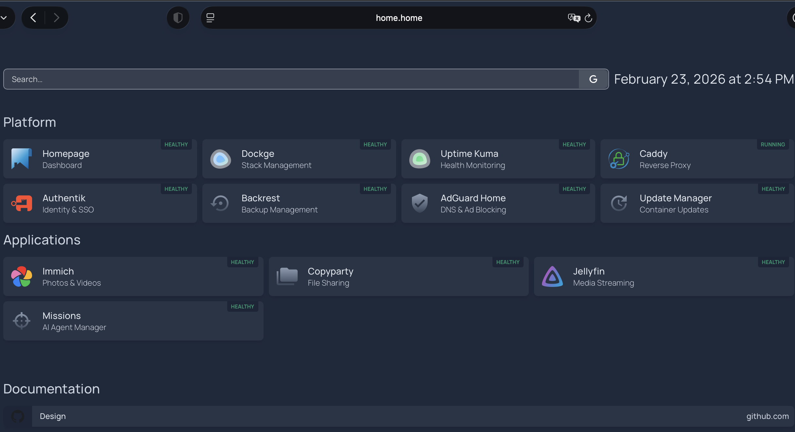

# Homelab Platform (Experimental)

Self-hosted personal infrastructure focused on user control, repeatable operations, and progressive independence from third-party services.

## Dashboard



## Current Baseline

- Primary host: Mac mini M4 (macOS + Docker Desktop)
- Secondary host: Raspberry Pi 5 (backup workflows + DMZ public services)
- Primary operator profile: solo power user
- Priority workloads: photo management, AI-assisted coding applications, media services

## Placeholder Legend

This README uses placeholders in commands/examples to avoid leaking local details:

- `<LAN_IP>`: your homelab host LAN IP (example format: `192.168.x.x`)
- `<TAILSCALE_IP>`: your homelab host Tailscale IP (example format: `100.x.y.z`)
- `<ROUTER_IP>`: your router gateway IP (example format: `192.168.x.1`)
- `<username>`: your local macOS username
- `<dmz-user>` / `<dmz-host>`: SSH user and hostname for a DMZ node
- `<backup-user>` / `<backup-host>`: SSH user and hostname for backup target node

## What This Repo Includes

- `platform/`: Core services (Caddy, Authentik, Homepage, Dockge, Tailscale, Uptime Kuma, etc.)
- `apps/`: Application stacks (Immich, Copyparty, Jellyfin, and others)
- `scripts/`: Operational scripts for deploy/update/backup/restore/DR verification
- `docs/`: Design, architecture, runbooks, security, roadmap, and onboarding docs
- `tests/`: Bats script and integration tests

## Getting Started

### 1. Prerequisites

1. macOS host with Docker Desktop installed and running
2. Git installed
3. At least 40 GB free disk space recommended
4. Optional: Tailscale auth key for remote access workflows
5. Optional: OpenClaw for all sorts of devops and integration possibilities (security risks apply) 

### 2. Clone the repo

```bash
git clone https://github.com/briancunningham6/homelab.git
cd homelab
```

### 3. Prepare environment files

- Copy each `.env.example` to `.env` where needed
- Fill required values (passwords, secrets, host/domain settings)

### 4. Validate compose files

```bash
HOMELAB_DIR=$(pwd) ./scripts/validate-compose
```

### 5. Start the platform

```bash
./scripts/platform-up
```

### 6. Verify core services

- Caddy routing
- Authentik login
- Homepage dashboard
- Uptime Kuma health panel

> Note: Before using most apps, create/sign in to an Authentik user account. App access is gated through Authentik SSO and that account is used for authentication across services.

### 7. Deploy your first app

```bash
./scripts/app-up immich
```

### 8. Configure DNS for `.home` hostnames

This platform uses Caddy virtual hosts such as `home.home`, `login.home`, and
`immich.home`. Your client device must resolve these names to the homelab host.

Option A: local `/etc/hosts` (simple, per-device)

1. Find your homelab IP:
   - local LAN: use your Mac mini LAN IP (for example `<LAN_IP>`)
   - remote via Tailscale: use your Mac mini Tailscale IP (for example `100.x.y.z`)
2. Add host entries:

```bash
sudo tee -a /etc/hosts << 'EOF'
# Homelab hostnames
<LAN_IP> home.home
<LAN_IP> login.home
<LAN_IP> status.home
<LAN_IP> dockge.home
<LAN_IP> immich.home
<LAN_IP> copyparty.home
<LAN_IP> jellyfin.home
<LAN_IP> backup.home
<LAN_IP> adguard.home
<LAN_IP> updates.home
<LAN_IP> missions.home
<LAN_IP> openclaw.home
EOF
```

Option B: Tailscale Split DNS (recommended for multiple devices)

1. Run a DNS resolver on the homelab host (AdGuard Home is used in this repo).
2. Create a wildcard rewrite in AdGuard Home:
   - `*.home -> <mac-mini-ip>`
3. In Tailscale admin:
   - DNS -> Nameservers -> add the homelab DNS resolver
   - Restrict domain to `.home` (Split DNS)
4. Reconnect Tailscale on client devices.

After either option, validate DNS/routing:

```bash
curl -I -H 'Host: home.home' http://127.0.0.1/
```

For more detail: `docs/networking.md` and `docs/mobile-access-architecture.md`.

### 9. Run day-2 operations

```bash
# Stop an app
./scripts/app-down <app>

# Update an app
./scripts/app-update <app> <new-version>

# Backup an app
./scripts/app-backup <app>

# Restore an app
./scripts/app-restore <app>

# DR readiness check
./scripts/dr-verify
```

## Build a Custom Homelab App (Agent-First)

Use this workflow when developing your own app stack in `apps/<your-app>/`.

### 1. Define the app contract

Before writing code/config, define:
- app purpose and user flow
- required hostname (`<app>.home`)
- auth model (prefer Authentik SSO where possible)
- data paths to back up
- required env vars and secrets

Reference: `docs/app-spec.md`

### 2. Use a coding agent to scaffold the app

Ask your coding agent to create:
- `apps/<app>/compose.yml`
- `apps/<app>/.env.example`
- `apps/<app>/README.md`
- `apps/<app>/app-contract.yaml`

Prompt template:

```text
Create a new homelab app called <app> following docs/app-spec.md.
Requirements:
- Hostname: <app>.home
- Docker image pinned to a version tag (not latest)
- Join caddy-net for reverse proxy routing
- Include healthcheck where supported
- Add backup scope notes in README
- Add Authentik/OIDC integration notes if app supports SSO
Generate compose.yml, .env.example, README.md, and app-contract.yaml.
```

### 3. Add Caddy route and DNS hostname

- Add a route in `platform/caddy/Caddyfile` for `http://<app>.home`
- Ensure hostname resolution via `/etc/hosts` or Tailscale Split DNS

### 4. Validate and deploy

```bash
# Validate all compose files
HOMELAB_DIR=$(pwd) ./scripts/validate-compose

# Start your app
./scripts/app-up <app>
```

### 5. Verify and operationalize

- verify app is reachable at `http://<app>.home`
- add homepage and uptime-kuma entries
- test backup/restore path:

```bash
./scripts/app-backup <app>
./scripts/app-restore <app>
```

- document final setup in `apps/<app>/README.md`
- update `docs/inventory.md` and `docs/runbook.md`

## Running Tests

Install Bats (macOS):

```bash
brew install bats-core
```

Run all tests:

```bash
bats -r tests
```

## Open Source Status

Completed foundations:

- `LICENSE` (MIT)
- `CODE_OF_CONDUCT.md`
- `CONTRIBUTING.md`
- `.github` issue/PR/security templates
- CI validation workflow (`.github/workflows/validate.yml`)
- Initial Bats test suite for critical scripts and restore cycle

Roadmap details: `docs/open-source-roadmap.md`

## Documentation Map

- Docs index: `docs/index.md`
- Manifesto: `manifesto.md`
- Bootstrap: `docs/bootstrap.md`
- Operations standard: `docs/ops-standard.md`
- DR runbook: `docs/dr-runbook.md`
- Security model: `docs/security.md`
- Support policy: `SUPPORT.md`
- Compatibility matrix: `docs/compatibility-matrix.md`

## Notes

- Keep secrets out of git; use `.env.example` templates only.
- This project is still experimental; optimize for a working vertical slice first.
